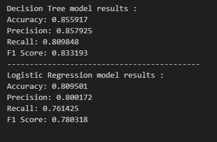

# Predicting-german-air-fares
Predicting air fares, giving insights to clients about their ticket cost.

## Overview 

In the initial phase of this project, our primary objective was to develop predictive model for estimating airfares in the German aviation market. Leveraging a comprehensive dataset, we undertook a systematic data preprocessing approach to ensure data quality and enhance model performance. This encompassed the identification and removal of outliers, feature engineering, and the application of appropriate encodings. Subsequently, we constructed and evaluated two distinct models: a logistic regression model and a tree-based model, specifically a decision tree. The logistic regression model exhibited commendable performance, with an accuracy rate of 0.80, a precision score of 0.80, a recall score of 0.76, and an F1 score of 0.78. Meanwhile, the decision tree model showcased even higher performance, achieving an accuracy rate of 0.85, a precision score of 0.85, a recall score of 0.80, and an F1 score of 0.83. These results signify our efforts in constructing predictive models to estimate airfares, laying a strong foundation for further analysis and decision-making within the aviation domain.

## Business Understanding

In the aviation industry, airfare prediction is a crucial aspect of managing costs and optimizing travel experiences for both airlines and passengers. Accurately predicting airfares can enable airlines to optimize their pricing strategies, maintain profitability, and align with market demand. For passengers, having access to realistic and up-to-date fare predictions can facilitate informed travel planning, enabling them to make cost-effective and informed decisions.

## Data Understanding

The data set was generated by web scraping and includes the ticket prices on 84 german connections over a period of 6 months. a total of 63,000 prices and connections are included in the data set, Refer to this [link](https://www.kaggle.com/datasets/darjand/domestic-german-air-fares) for more informations.

## Modeling and Evaluation

Evaluation of both models are shown in the image below :

The decision tree model was used to find most important features that impacts the air fares which are shown below : 

Also some insights gathered from the logistic regression model : 

The pricing structure of airline tickets is influenced by various factors, including the number of stops and the departure day. In general, the more connections a flight has, the higher the price. This is because multiple stops add complexity to the itinerary, such as additional layovers and potential delays. As a result, airlines charge a premium for flights with multiple stops to compensate for the increased costs and inconvenience.

Similarly, departure day plays a significant role in determining ticket prices. Typically, flights departing on weekdays, particularly Mondays and Tuesdays, are more affordable than those departing on weekends.
